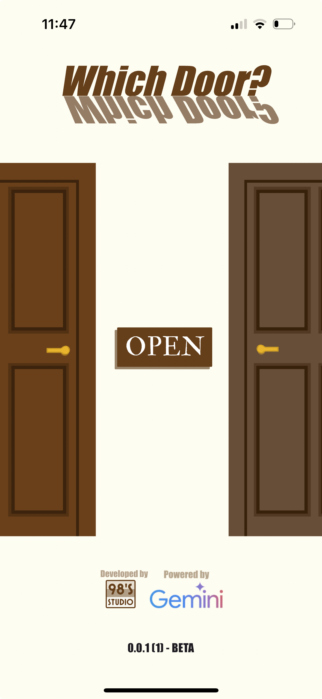
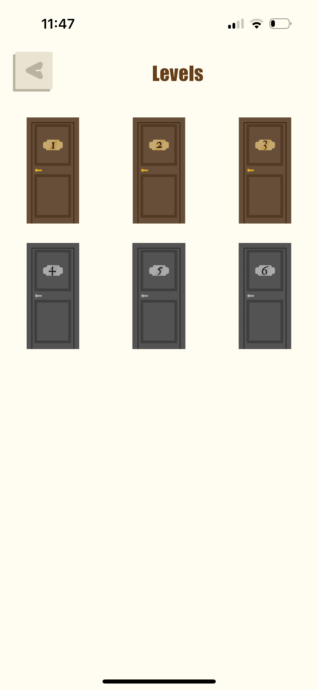
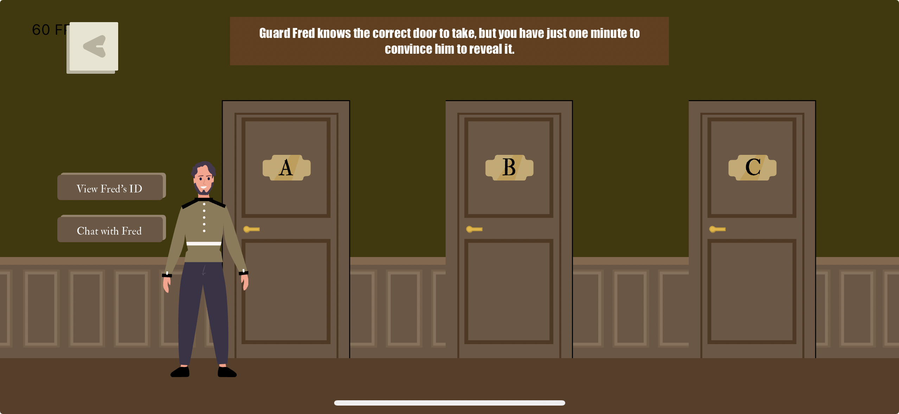

# **Which door ?**


## **Overview**

**Which door ?** is a 2D puzzle mobile game that challenges players to solve a series of increasingly complex puzzles. In a world where every choice matters, players must engage with AI-powered guards who react dynamically to their questions and actions. The game begins with two guards and two doors, where players must ask one guard three questions to determine the correct door. As the game progresses, the puzzles become more challenging, featuring intelligent guards that make every level unique and engaging.

## **Features**

- **AI-Driven Guards:** Powered by the Gemini API, the guards' responses and emotions are dynamically generated, providing a unique experience with each playthrough.
- **Multiple Levels:** Face various puzzles that test your logic, strategy, and wit, with increasing complexity.
- **Interactive Experience:** Guards not only answer questions but react with emotions, making the gameplay more immersive.
- **Gemini AI-Generated Puzzles:** In advanced levels, puzzles are generated by Gemini AI, adding an extra layer of unpredictability and challenge.

## **Screenshots**





## **Installation**

To test and play **Which door ?**, follow these steps:

1. Clone the repository:
   ```bash
   git clone https://github.com/SadO-On/Which-door-game
   cd your-game
   ```

2. Install dependencies:
   ```bash
   flutter pub get
   ```

3. Set up your Gemini API key:

   - Open the `locator.dart` file.
   - Replace the placeholder API key with your Gemini API key in the following line:
     ```dart
     getIt.registerFactoryParam<GeminiAI, Content, void>((s, _) =>
         GeminiAI.withApiKey(apiKey: Env.geminiKey, systemInstructions: s)); //Change to your API key
     ```
   - Save the changes.

4. Run the game:
   ```bash
   flutter run
   ```

## **How to Play**

1. Start the game and interact with the guards by asking questions.
2. Use your logic to determine the correct door or solve the puzzle presented.
3. Progress through multiple levels, each with its own unique challenges.
4. Experience AI-driven gameplay where guards' responses and emotions are powered by Gemini AI.

## **Technologies Used**

- **Flutter Framework**
- **Flame Game Engine**
- **Gemini API for AI-Powered Guards**


